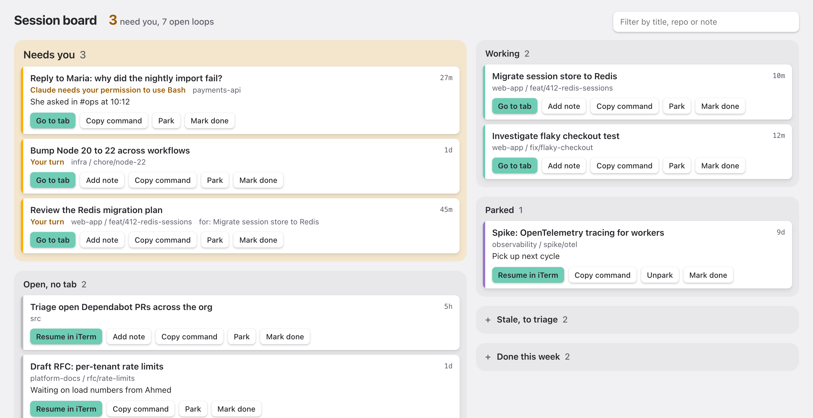
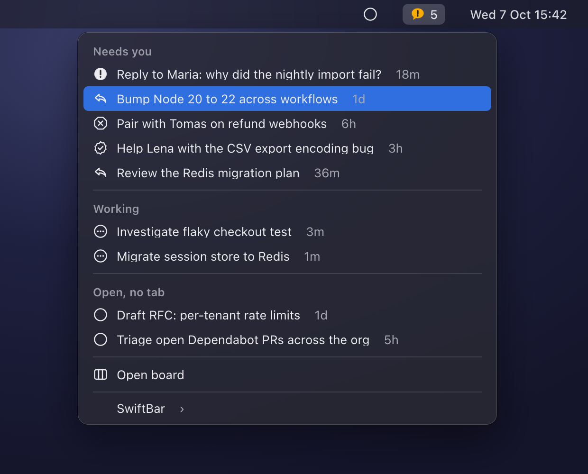

# cc-hud

Close your Claude Code tabs whenever you like. The work stays on the board until you tick it off.

<picture>
  <source media="(prefers-color-scheme: dark)" srcset="docs/board-dark.png">
  
</picture>

## Why

I used to forget about Claude Code sessions. The computer rebooted, or I lost my iTerm tabs for some other reason, and whatever was in them was gone from my head. Some of it was a reply I owed someone.

With cc-hud, closing a tab and finishing the work are two different things. I close tabs freely to clean up my screen. The session stays on the board, one click from resuming, until I explicitly mark it done.

## What you get

- **A board** at `http://localhost:7777`. Sessions are grouped into Needs you, Working, Open (no tab), Parked, Stale and Done this week (struck through). Each has a note field and a filter.
- **Go to tab** brings the iTerm tab of a live session to the front. **Resume in iTerm** opens a closed session in a new tab, in the right folder.
- **A menu bar item** (SwiftBar) with the number of sessions that need you. Click a session to jump to it.
- **A Slack digest** twice a day. It lists sessions waiting on you for over an hour, and open sessions untouched for a day. A board you have to remember to open fails the same way idle tabs do, so this one comes to you.
- **PR status on each session.** A session's strip shows the last thing that happened on its pull request: `commitlint failed, 5m ago`, `2 checks running`, `Copilot reviewed, 1m ago`. Claude Code records which PRs a session opened or pushed to, so this works without any setup in your sessions. When a closed tab's PR goes red, gets changes requested or is merged, the session moves to Needs you. A merged PR asks whether you want to mark the session done.
- **Faces of the people you're helping.** When a session is about a GitHub PR or issue, its strip shows the avatar of whoever opened it and links to it. Your own PRs show an assignee instead, or no face.
- **`/done`** inside any session marks it done. `/done park back next cycle` parks it with a note. Typing in a done or parked session reopens it.



Claude Code's own `claude agents` shows what is live right now. cc-hud remembers the rest: closing a tab or rebooting only moves a session to "Open, no tab".

## How it works

```
Claude Code hooks --> hud-event.sh --+
                                     +--> ~/.claude/hud/hud.db (SQLite) --> board, menu bar, digest
claude agents --json (every 60s) ----+
```

- A hook on seven lifecycle events records each session's live state: working, waiting for input, idle, or gone. It takes about 20 ms and never fails the session.
- A launchd job reconciles against `claude agents --json` every minute and reads titles from the transcripts. That catches anything the hooks miss, such as a reboot.
- On first install, the last 30 days of transcripts are imported as Stale. You triage them once instead of starting with a wall of open sessions.

The board loads nothing from the internet. Two things do leave your machine:

- The snapshot job asks the GitHub API, through your own `gh` login, who opened each PR or issue your sessions link to, and downloads their avatar once into `~/.claude/hud/avatars/`. It also polls the state of those PRs: one GraphQL request a minute at most, covering only open sessions, and less often for sessions you haven't touched in two days.
- The optional digest goes to your own Slack webhook. It contains session titles, repo folder names and ages, never prompt text.

## Requirements

- macOS and iTerm2. Resume and Go to tab use iTerm's AppleScript API.
- A Claude Code version that has `claude agents --json`.
- `uv`, `jq` and `sqlite3`.
- Optional: [SwiftBar](https://github.com/swiftbar/SwiftBar) for the menu bar item, an authenticated [`gh`](https://cli.github.com) for avatars and PR status, and a Slack incoming webhook for the digest.

## Install

```sh
git clone https://github.com/anderssonjohan/cc-hud.git
cd cc-hud
./install.sh
```

The script changes these things, and is safe to re-run:

- Adds the hook to seven events in `~/.claude/settings.json`. It saves a backup as `settings.json.bak-cc-hud` first.
- Installs `/done` as `~/.claude/commands/done.md`, unless you already have a different command with that name.
- Installs three launchd agents: the board server, the 60-second snapshot and the digest.

For the menu bar, open SwiftBar and set its plugin folder to `cc-hud/swiftbar`.

For the digest, store your webhook in the login Keychain:

```sh
security add-generic-password -a "$USER" -s claude-slack-webhook -w 'https://hooks.slack.com/services/...'
```

To remove everything except your data in `~/.claude/hud/`, run `./install.sh --uninstall`.

## Command line

```
hud.py ls [-a]                  open and parked sessions (-a adds stale and done)
hud.py done [id] [-m note]      mark done; with no id, the session you run it from
hud.py park [id] [-m note]
hud.py open [id]
hud.py note "text" [-s id]
hud.py link <other> [-s id]     show that this session works for another one (a reviewer tab)
hud.py go <id>                  focus the session's tab, or resume it in a new one
hud.py resume <id> [-p]         resume in a new iTerm tab (-p prints the command)
hud.py digest [-n]              post the digest (-n prints it instead)
hud.py backfill [--days 30]
```

An id can be a session id prefix, a background session id or a session name.

## Configuration

| Variable | Default | |
|---|---|---|
| `HUD_DB` | `~/.claude/hud/hud.db` | Where the ledger lives |
| `HUD_SLACK_WEBHOOK` | | Webhook URL, instead of the Keychain |
| `HUD_SLACK_KEYCHAIN_SERVICE` | `claude-slack-webhook` | Keychain item holding the webhook |
| `HUD_BACKFILL_DAYS` | `30` | History imported on first install |
| `HUD_LABEL_PREFIX` | `io.github.anderssonjohan.cc-hud` | launchd label prefix |

Automation accounts that look like people (a CI user, say) can be hidden from avatars: put their logins in `~/.claude/hud/ignore-logins`, one per line. Accounts GitHub marks as bots are skipped anyway.

The digest runs at 09:00 and 13:30. Change the times in `install.sh` and re-run it.

## Security

The board listens on `127.0.0.1` only. Requests must carry a `localhost` Host header, which blocks DNS rebinding. Every request that changes something needs a custom header, so other web pages can't trigger a resume from your browser.

## Tips

- Name your sessions: `claude -n "reply to Maria: nightly import"`. A name you chose beats a generated title when you scan the board a week later.
- Park what you won't touch today. "Needs you" only works as a signal if it stays short.

## Development

The tools run from a uv project. The app itself uses only the Python standard library, so the lock file holds just ruff and ty.

```sh
uv sync
uv run ruff check .
uv run ruff format --check .
uv run ty check
```
